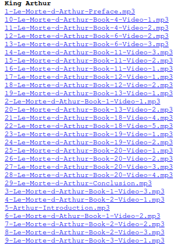

# Example
Hello There! So here is an example of what that looks like. On my end, if I want to watch a movie on any of my other devices on my local network, I would just go load it from the HomeServer.          
I will probably redo this in the future and add things like buffering and adding on to the User-Interface. Most importantly I will probably add a proper search bar. I primarily use the ctrl F/find in page feature so idk man.


# Set up and run
```
git clone https://github.com/pendragons-code/HomeServer
cd HomeServer
npm i
mkdir Src/frontEnd/public/Videos/
```

# Organize
go to `Src/frontEnd/public/Videos` and add a folder with the stuff inside.          
So let's say:
```
Src/frontEnd/public/Videos/Cuco/CUCO - Lover Is a Day (Audio).mp4
```
